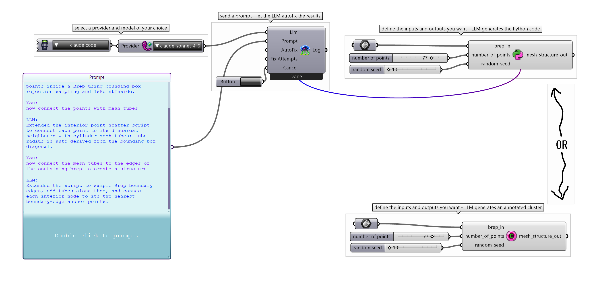

> **⚠️ This is a v0.1.0-alpha prototype.** The core functionality works, but the architecture is being rewritten for v0.2. Expect breaking changes. See [Roadmap](#roadmap).

Physalia is a free, open-source Grasshopper plugin that uses LLMs to generate Python Script and node-based cluster components directly inside your Grasshopper canvas.

**Bring your own Keys.** 

**Use a subscription (Claude Code).** **Use free models (Opencode Zen, Openrouter, Gemini).** **Keep total control of your own data (Ollama).**

AGPL-3.0 licensed.

---

## What it does

- Generates Python Script components with correct inputs and outputs from a natural language prompt
- Generates node-based components
- Automatically detects and fixes runtime errors in generated components
- Supports iterative refinement — prompt back and forth to tweak generated components
- Supports the following APIs:
   - OpenAI
   - Anthropic
   - Google Gemini (generous free tier)
   - OpenRouter (provides free models)
   - OpenCode Zen (provides free models)
   - DeepSeek
   - Groq
   - Github Models
- Runs local models via Ollama — no API key or internet connection required
- Runs via the Claude Code SDK — if you have Claude Code installed, no API key is needed.

---

## What it doesn't do (yet)

- **No image input** — you can't reference a sketch or screenshot to generate from
- **No Rhino/Grasshopper document awareness** — it has no knowledge of your canvas, geometry, or data outside of it's own generated components
- **No self-reference** — You cannot (easily) use Physalia created components within new generated components.
- **No LLM parameter control** — temperature, top-p, and other model settings aren't exposed yet

All of this is the v0.2 roadmap.

---

## Installation

*Requirements: Rhino 8 (Windows or Mac)*

1. Download the latest release from the [Releases](../../releases) page
2. Unzip and place the folder in your Grasshopper Libraries directory
   - Windows: `%AppData%\Grasshopper\Libraries`
   - Mac: `~/Library/Application Support/McNeel/Rhinoceros/8.0/Plug-ins/Grasshopper/Libraries`
3. Restart Rhino

---

## Setup

Physalia supports several ways to get started, including free and local options.

For providers that require a key:

1. In Grasshopper, right-click the **Provider** component
2. Select **Edit API Keys File**
3. Add your API key to the 'physaliaKeys.json' file that opens.

For Ollama, ensure Ollama is running locally before launching Grasshopper.

For Claude Code, ensure `claude` is running in a terminal session before using the plugin.

---

## Roadmap

### v0.1.0-alpha — current
- Component generation (Python Script, node-based)
- Iterative refinement via back-and-forth prompting
- Automatic error fixing
- BYOK, multi-provider support
- Local models via Ollama
- Claude Code SDK support
- Prototype architecture — functional but not extensible.

### v0.2.0 — in development ([`dev`](../../tree/dev))
A ground-up architectural rewrite. v0.2 will support image reference, Grasshopper document awareness, and — most importantly — the ability for the system to reference and build on previously generated components.

---

## Why Physalia

Physalia is designed as a free, auditable alternative to paid LLM plugins for Grasshopper. The AGPL-3.0 license means it stays open — any fork that ships must also stay open.

---

## Contributing

The codebase in `main` is prototype-quality and will be superseded by the v0.2 rewrite. If you want to contribute, the best place to engage is the `dev` branch once the rewrite is underway, or by opening an issue with feedback from using the current beta.

---

## License

[AGPL-3.0](LICENSE)
